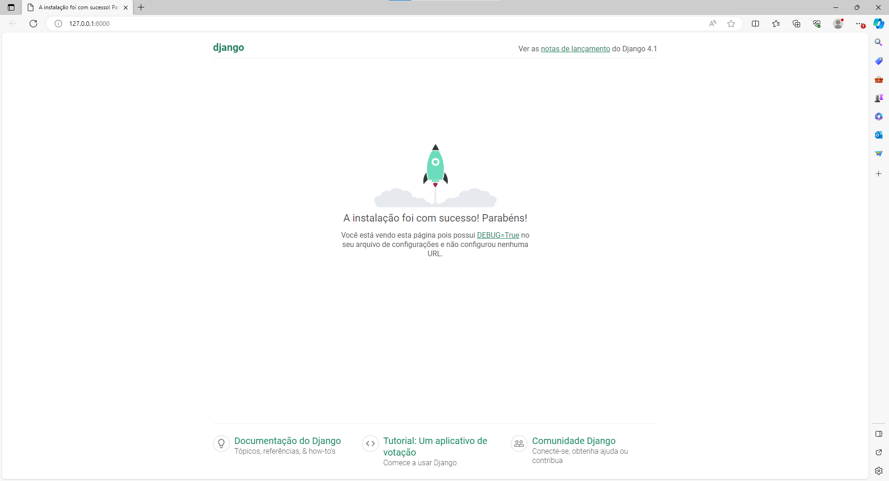

# 🚀 DESENVOLVEDOR WEB COM PYTHON E DJANGO

Serviço Nacional de Aprendizagem Industrial - SENAI DF  
Brasília, 17 de junho de 2026  
Anderson de Matos Guimarães  
Professor: Rômulo César

## Ativar o servidor

```python
python manage.py runserver
```




## Django templates

### Relembrando

- Model (Classes de entidade)
- Templates (Front-end)
- Views (renderiza o front-end: para qual página html enviar e a parir dos models)
  
### Criando as views (Adeus foguetinho!)

Em `motorartigos > views.py`:

```python
rom django.shortcuts import render
from django.http import HttpResponse # incluído para criar a maninupar 'respostas' HTTP

# Create your views here.
# Aqui vou criar minhas rotas
# Minhas regra de negócio

def index(request):
    return HttpResponse("<h1>Oi</h1>") # Cria a 'página' HTML (index)
```

## Configurando a rota - aqui começa pra valer

1. Em `motorartigos > urls.py` (caso urls.py não existir, criar o arquivo)

```python
from django.urls import path # incluído
from motorartigos.views import index # incluído

urlpatterns = [
    path('', index), # define a rota do próprio app
]
```

2. `Em setup > urls.py` (não é o mesmo que `motorartigos>urls.py`):

```python
from django.contrib import admin
from django.urls import path, include # incluído

urlpatterns = [
    path('admin/', admin.site.urls),
    path('', include('motorartigos.urls')), # incluir a url do app (chamar a que foi criada acima, no app)
]
```

## Configurar o diretório `templates`

Em `setup > settings.py`:

1. Confirmar que módulo `os` foi importado
2. Em `TEMPLATES`, no `DIRS`:
   
  ```python
  TEMPLATES = [
    {
        'BACKEND': 'django.template.backends.django.DjangoTemplates',
        'DIRS': [os.path.join(BASE_DIR,'templates')], # incluído
        'APP_DIRS': True,
        'OPTIONS': {
            'context_processors': [
                'django.template.context_processors.debug',
                'django.template.context_processors.request',
                'django.contrib.auth.context_processors.auth',
                'django.contrib.messages.context_processors.messages',
            ],
        },
    },
  ]
  ```

  DIRS - informa para o DJANGO onde buscar templates adicionais

## Criando e renderizando templates 

Na pasta templates (se não existir, deve ser criada dentro da raiz do diretório):

1. Criar uma pasta com o mesmo nome do aplicativo (`motorartigos`)
2. Dentro da pasta mortorartigos, criar a pasta `index.html`
3. Criar a página html em `index.html` com '!':
   
```html
   !DOCTYPE html>
<html lang="pt-br">
<head>
    <meta charset="UTF-8">
    <meta name="viewport" content="width=device-width, initial-scale=1.0">
    <title>Django Artigos</title>
</head>
<body>
    
    <h1>O mehlhor site de Django, IA e Data Science do Brasil</h1>
</body>
</html>
```

4. Definir a rota em `motorartigos > views.py`:

```python
def index(request):
    # return HttpResponse("<h1>Oi</h1>") comentado, pois iremos usar index.html
    return render(request, 'templates\motorartigos\index.html') # ativa a página index.html
```
